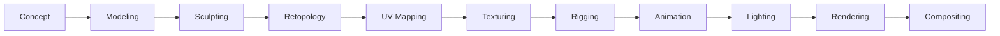

# 🎨 Ultimate 3D Resources Hub

*A comprehensive collection of 3D design software, learning resources, tools, and community assets for creators at all skill levels*


## 📚 Table of Contents
- [Free 3D Design Software](#-free-3d-design-software)
- [Professional 3D Software](#-professional-3d-software)
- [CAD Software & Resources](#-cad-software--resources)
- [Learning Resources](#-learning-resources)
- [3D Assets & Libraries](#-3d-assets--libraries)
- [Textures & Materials](#-textures--materials)
- [Lighting Resources](#-lighting-resources)
- [Houdini Resources](#-houdini-resources)
- [Community & Forums](#-community--forums)
- [Workflow & Techniques](#-workflow--techniques)

---

## 🆓 Free 3D Design Software

### **[Blender](https://www.blender.org/)** - Industry Standard Open-Source Suite

- **Download:** [Official Downloads](https://www.blender.org/download/)
- **Features:** Complete 3D pipeline - modeling, rigging, animation, simulation, rendering, compositing, motion tracking
- **Best For:** Professional 3D animation, game development, VFX, architectural visualization
- **Learning Curve:** Advanced - steep initial learning but extensive resources available
- **Resources:** 
  - [Official Manual](https://docs.blender.org/)
  - [Blender Guru Donut Tutorial](https://www.youtube.com/watch?v=nIoXOplUvAw) (Famous beginner series)
  - [Blender Studio Training](https://studio.blender.org/training/)

### **[MagicaVoxel](https://ephtracy.github.io/)** - Voxel Art Editor
- **Features:** GPU-based voxel editor with path tracing renderer, supports volumes up to 2048³
- **Best For:** Voxel art, indie game assets, Minecraft content, retro 3D art
- **Learning Curve:** Beginner to Intermediate
- **Community:** [r/MagicaVoxel](https://reddit.com/r/MagicaVoxel)

### **[MagicaCSG](https://ephtracy.github.io/index.html?page=magicacsg)** - CSG Modeling
- **Platform:** Windows 64-bit only
- **Features:** SDF-based modeling with real-time Boolean operations
- **Best For:** Concept design, abstract geometric art, rapid prototyping

### **[SculptGL](https://stephaneginier.com/sculptgl/)** - Browser Sculpting
- **Access:** Direct browser access, no download required
- **Features:** WebGL-powered sculpting with dynamic topology
- **Best For:** Quick sculpting sketches, organic character modeling, 3D printing prep

### **[Tinkercad](https://www.tinkercad.com/)** - Beginner-Friendly CAD
- **Features:** Browser-based CSG modeling, 3D printing optimization, educational tools
- **Best For:** STEM education, simple 3D printing projects, absolute beginners
- **Learning:** [Tinkercad Learning Center](https://www.tinkercad.com/learn)

### **[Vectary Free](https://www.vectary.com/)** - Limited Free Plan
- **Features:** Real-time 3D modeling, AR support, photorealistic materials
- **Limitations:** 5 projects max, basic materials only
- **Best For:** Product visualization, AR experiences, web 3D content

### **[SketchUp Free](https://www.sketchup.com/)** - Architectural Design
- **Access:** [Web Version](https://app.sketchup.com/app)
- **Features:** Push/pull modeling, 3D Warehouse access, 10GB cloud storage
- **Best For:** Architecture, interior design, woodworking
- **Resources:** [SketchUp Campus](https://campus.sketchup.com/)

### **[Womp3D Free](https://www.womp.com/)** - Liquid Boolean Modeling
- **Features:** "Goop" modeling system, cloud rendering, community sharing
- **Best For:** Abstract art, social media content, creative exploration

### **[Clara.io](https://clara.io/)** *(Note: Discontinued Dec 2022)*
- **Status:** Service discontinued but included for reference

### **[Wings 3D](https://www.wings3d.com/)** - Subdivision Modeling
- **Download:** [SourceForge](https://sourceforge.net/projects/wings/)
- **Features:** Advanced subdivision surface modeling, context-sensitive interface
- **Best For:** Polygon modeling for games, character modeling

---

## 💎 Professional 3D Software

### **[Spline](https://spline.design/)** - Real-Time Web 3D

- **Pricing:** Free tier available, Pro from $12/month
- **Features:** Browser-based real-time 3D, parametric objects, AI tools, React export
- **Best For:** Web designers, interactive presentations, marketing

### **[Womp3D Pro](https://www.womp.com/)** - Advanced Features
- **Pricing:** $12.99/month (Pro), Team plans available
- **Features:** 500+ Super Materials, unlimited 4K exports, advanced tools
- **Best For:** Product design, 3D printing, concept art

### **[Vectary Premium](https://www.vectary.com/)** - Professional Web 3D
- **Pricing:** Studio $5/month, Teams $25/month
- **Features:** CAD import, AR capabilities, team collaboration
- **Best For:** Product design, e-commerce, AR/VR development

### **[Cinema 4D](https://www.maxon.net/)** - Motion Graphics Powerhouse
- **Pricing:** $69.91/month (annual) 
- **Features:** MoGraph tools, character animation, Redshift integration
- **Best For:** Motion graphics, VFX, advertising
- **Learning:** [Cineversity](https://www.cineversity.com/)

### **[3DCoat](https://3dcoat.com/)** - Sculpting & Texturing Suite
- **Pricing:** €299 perpetual license
- **Features:** Voxel sculpting, industry-standard retopology, PBR texturing
- **Best For:** Game development, character design, 3D printing

### **[Substance 3D Modeler](https://www.adobe.com/products/substance3d/apps/modeler.html)** - VR/Desktop Sculpting
- **Pricing:** $49.99/month (Collection) or $19.99/month (Individual)
- **Features:** VR and desktop sculpting, SDF modeling, Adobe integration
- **Best For:** Concept art, VFX, game development

### **[Modo](https://www.foundry.com/products/modo)** *(Note: Development discontinued 2024)*
- **Pricing:** $599/year subscription
- **Features:** Advanced polygon modeling, procedural workflows
- **Status:** Final version 17.1, extended licensing available

### **[ZBrush](https://www.maxon.net/en/zbrush)** - Industry-Standard Sculpting
- **Pricing:** £26.90/month (annual commitment)
- **Features:** 200+ brushes, DynaMesh, ZRemesher, PolyPaint
- **Best For:** Film VFX, game characters, toy design
- **Community:** [ZBrush Central](https://www.zbrushcentral.com/)

### **[Nomad Sculpt](https://nomadsculpt.com/)** - Mobile 3D Sculpting
- **Pricing:** $19.99 one-time (mobile), Desktop beta free
- **Platform:** iOS/iPadOS, Android, Windows/macOS beta
- **Features:** Full mobile sculpting, PBR materials, layer system

### **[Houdini](https://www.sidefx.com/)** - Procedural Powerhouse
- **Pricing:** Indie $269/year, FX $4,495/year, Free Apprentice version
- **Features:** Node-based procedural workflows, advanced VFX simulations
- **Best For:** Film VFX, procedural modeling, technical art
- **Learning:** See [Houdini Resources](#-houdini-resources) section below

---

## 🔧 CAD Software & Resources

### Free CAD Software

#### **[FreeCAD](https://www.freecad.org/)**
- **Features:** Parametric 3D modeling, Python scripting, FEA/CAM capabilities
- **Best For:** Product design, mechanical engineering, architecture

#### **[Onshape Free](https://www.onshape.com/en/products/free)**
- **Features:** Cloud-based, real-time collaboration, professional-grade tools
- **Limitations:** All designs public, non-commercial only

#### **[Fusion 360 Personal](https://www.autodesk.com/products/fusion-360/personal)**
- **Features:** Integrated CAD/CAM/CAE, cloud-based, simulation tools
- **Best For:** Product design, 3D printing, hobbyist projects

#### **[OpenSCAD](https://openscad.org/)**
- **Features:** Script-based modeling, parametric design through code
- **Best For:** Programmers, technical parts, 3D printing

#### **[LibreCAD](https://librecad.org/)**
- **Features:** 2D CAD, DXF/DWG compatibility, AutoCAD-like interface
- **Best For:** 2D drafting, technical drawings

### Professional CAD Software

| Software | Starting Price | Best For | Key Feature |
|----------|---------------|----------|-------------|
| **[AutoCAD](https://www.autodesk.com/products/autocad)** | $210/month | Architecture, Engineering | Industry standard, DWG format |
| **[SolidWorks](https://www.solidworks.com/)** | $2,820/year | Mechanical Engineering | Parametric modeling, simulation |
| **[CATIA](https://www.3ds.com/products/catia)** | Custom quote | Aerospace, Automotive | Advanced surface modeling |
| **[Inventor](https://www.autodesk.com/products/inventor)** | $2,085/year | Manufacturing | Assembly design, FEA |
| **[Rhino](https://www.rhino3d.com/)** | $995 perpetual | Industrial Design | NURBS modeling, Grasshopper |

### CAD Learning Resources
- **YouTube Channels:** Lars Christensen, NYC CNC, CAD in Black
- **Forums:** [r/CAD](https://reddit.com/r/CAD), [Engineering.com](https://engineering.com)
- **File Libraries:** [GrabCAD](https://grabcad.com), [Thingiverse](https://thingiverse.com)

---

## 📖 Learning Resources

### Video Tutorial Platforms

#### **Beginner-Friendly**
- [Blender Guru](https://www.youtube.com/user/AndrewPPrice) - Famous donut tutorial series
- [Grant Abbitt](https://www.youtube.com/user/mediagabbitt) - Low-poly modeling
- [CG Cookie](https://cgcookie.com/) - Structured Blender courses

#### **Intermediate to Advanced**
- [Ian Hubert](https://www.youtube.com/user/mrdodobird) - "Lazy Tutorials" series
- [CGMatter](https://www.youtube.com/channel/UCy1f4m64dwCwk8CBZ_vHfPg) - Technical Blender tutorials
- [Arrimus 3D](https://www.youtube.com/user/Arrimus3D) - Hard surface modeling

### Structured Learning Platforms

| Platform | Type | Price | Best For |
|----------|------|-------|----------|
| **[CGCookie](https://cgcookie.com/)** | Blender-focused | $29/month | Comprehensive Blender learning |
| **[Udemy](https://www.udemy.com/)** | Marketplace | Per course | Wide variety of software |
| **[Pluralsight](https://www.pluralsight.com/)** | Professional | $29/month | Industry professionals |
| **[LinkedIn Learning](https://www.linkedin.com/learning/)** | Professional | $26.99/month | Career development |
| **[Domestika](https://www.domestika.org/)** | Creative focus | Per course | Artistic approach |

### Free Learning Resources
- **[Blender Manual](https://docs.blender.org/manual/en/latest/)** - Official comprehensive documentation
- **[YouTube](https://youtube.com)** - Thousands of free tutorials
- **[BlenderNation](https://www.blendernation.com/)** - News and tutorials
- **[3D Total](https://www.3dtotal.com/)** - Tutorials and inspiration

---

## 🎨 3D Assets & Libraries

### Free Model Resources

#### **General Libraries**
- **[Sketchfab](https://sketchfab.com/)** - Massive 3D model library with downloadable content
- **[Free3D](https://free3d.com/)** - Large collection of free models
- **[TurboSquid](https://www.turbosquid.com/Search/3D-Models/free)** - Professional models with free section
- **[CGTrader](https://www.cgtrader.com/free-3d-models)** - Community marketplace with free models

#### **Specialized Collections**
- **[NASA 3D Resources](https://nasa3d.arc.nasa.gov/)** - Space-related models, many 3D printable
- **[Smithsonian 3D](https://3d.si.edu/)** - Historical artifacts and cultural objects
- **[Google Poly Archive](https://poly.pizza/)** - Community preservation of Google Poly
- **[Quaternius](https://quaternius.com/)** - Free low-poly game assets

### Asset Marketplaces

| Marketplace | Specialty | Price Range | Quality |
|------------|-----------|-------------|---------|
| **[ArtStation Marketplace](https://www.artstation.com/marketplace)** | Professional assets | $$ - $$$ | High |
| **[Unity Asset Store](https://assetstore.unity.com/)** | Game-ready assets | $ - $$$ | Varied |
| **[Unreal Marketplace](https://www.unrealengine.com/marketplace)** | UE-optimized | $$ - $$$ | High |
| **[Blender Market](https://blendermarket.com/)** | Blender-specific | $ - $$ | Good |

---

## 🖼️ Textures & Materials

### PBR Texture Libraries (Free)

#### **[ambientCG](https://ambientcg.com/)**
- 2000+ free PBR materials, HDRIs, and models
- CC0 license (completely free use)
- Categories: Ground, Wood, Metal, Fabric, Nature

#### **[Polyhaven](https://polyhaven.com/)**
- High-quality HDRIs, textures, and models
- All assets CC0
- 8K+ resolution available

#### **[Free PBR](https://freepbr.com/)**
- Hundreds of free PBR materials
- Organized by category
- Direct download, no registration

#### **[Texture Haven](https://texturehaven.com/)** *(Now part of Polyhaven)*
- Legacy site redirects to Polyhaven
- Historical reference for tutorials

### Premium Texture Resources

| Resource | Type | Price | Best For |
|----------|------|-------|----------|
| **[Poliigon](https://www.poliigon.com/)** | PBR textures | Subscription | Architecture, VFX |
| **[Quixel Megascans](https://quixel.com/)** | Scanned materials | Free with UE | Photorealism |
| **[Substance Source](https://substance3d.adobe.com/assets)** | Procedural | Adobe subscription | Flexibility |
| **[TextureBox](https://texturebox.com/)** | Mixed library | Free & Premium | Variety |

### Material Creation Tools
- **[Materialize](http://www.boundingboxsoftware.com/materialize/)** - Free texture map generation
- **[Substance Designer](https://www.adobe.com/products/substance3d-designer.html)** - Industry standard procedural texturing
- **[ArmorPaint](https://armorpaint.org/)** - Open-source texture painting

---

## 💡 Lighting Resources

### Lighting Fundamentals

#### **Three-Point Lighting System**
1. **Key Light** - Primary illumination (45° to camera)
2. **Fill Light** - Softens shadows (opposite key)
3. **Rim/Back Light** - Creates separation from background

### Lighting Types & Techniques

| Light Type | Use Case | Software Support |
|------------|----------|------------------|
| **Point/Omni** | Light bulbs, candles | All software |
| **Spot** | Flashlights, stage lights | All software |
| **Area** | Windows, softboxes | Most software |
| **Sun/Directional** | Outdoor scenes | All software |
| **HDRI/Environment** | Realistic lighting | Advanced renderers |

### HDRI Resources
- **[HDRI Haven](https://hdri-haven.com/)** *(Now Polyhaven)* - Free HDRIs up to 16K
- **[sIBL Archive](http://www.hdrlabs.com/sibl/archive.html)** - Classic HDRI collection
- **[HDR Maps](https://hdrmaps.com/)** - Commercial HDRIs
- **[Greg Zaal](https://blog.gregzaal.com/)** - HDRI creation tutorials

### Render Engines & Lighting

| Engine | Type | Strengths | Best For |
|--------|------|-----------|----------|
| **Cycles** (Blender) | Path tracing | Accuracy | Photorealism |
| **Eevee** (Blender) | Real-time | Speed | Previews, stylized |
| **Arnold** | Ray tracing | Film quality | VFX, animation |
| **V-Ray** | Hybrid | Versatility | Architecture |
| **Octane** | GPU | Speed + quality | Product viz |

---

## 🔮 Houdini Resources

### Getting Started
- **[Houdini Apprentice](https://www.sidefx.com/products/houdini-apprentice/)** - Free learning version
- **"Houdini Isn't Scary"** by Nine Between - Beginner-friendly introduction
- **[SideFX Tutorials](https://www.sidefx.com/tutorials/)** - Official learning path

### Essential Learning Resources

#### **Websites & Documentation**
- **[CGWiki (tokeru.com)](https://www.tokeru.com/cgwiki/)** - Comprehensive VEX tutorials
- **[Entagma](https://entagma.com/)** - Advanced procedural techniques
- **[Applied Houdini](https://www.appliedhoudini.com/)** - Professional VFX workflows

#### **VEX Programming**
```vex
// Basic VEX examples
@Cd = @P * chf('scale');        // Color based on position
@P.y += sin(@P.x * 4);           // Wave deformation
if (rand(@ptnum) > ch('threshold')) {
    removepoint(0, @ptnum);      // Random point deletion
}
```

### Tools & Extensions
- **[MOPS](https://github.com/toadstorm/MOPS)** - Motion graphics toolkit
- **[SideFX Labs](https://github.com/sideeffects/SideFXLabs)** - Extended toolset
- **[qLib](https://github.com/qLab/qLib)** - Open-source tools
- **[Game Development Toolset](https://github.com/sideeffects/GameDevelopmentToolset)** - Game-focused tools

### Community & Support
- **[OdForce](https://forums.odforce.net/)** - Most active Houdini forum
- **[Think Procedural Discord](https://discord.gg/thinkprocedural)** - Real-time help
- **[r/Houdini](https://reddit.com/r/Houdini)** - Reddit community
- **[Houdini Artists Facebook](https://facebook.com/groups/HoudiniArtists)** - Social community

### Learning Paths

| Level | Timeline | Focus Areas | Resources |
|-------|----------|-------------|-----------|
| **Beginner** | 0-6 months | Interface, basic SOPs, simple VEX | Official tutorials, Houdini Isn't Scary |
| **Intermediate** | 6-18 months | Complex VEX, simulations, HDAs | CGWiki, Applied Houdini |
| **Advanced** | 18+ months | Custom solvers, pipeline tools | Entagma, production experience |

---

## 👥 Community & Forums

### General 3D Communities
- **[ArtStation](https://www.artstation.com/)** - Professional portfolio platform
- **[Polycount](https://polycount.com/)** - Game art community
- **[CGSociety](https://cgsociety.org/)** - VFX and animation professionals
- **[DeviantArt](https://www.deviantart.com/)** - Art community with 3D section

### Software-Specific Forums

| Software | Primary Forum | Secondary | Discord |
|----------|--------------|-----------|---------|
| **Blender** | [BlenderArtists](https://blenderartists.org/) | [r/blender](https://reddit.com/r/blender) | [Blender Discord](https://discord.gg/blender) |
| **Maya** | [Autodesk Forums](https://forums.autodesk.com/t5/maya/ct-p/area-c14) | [SimplyMaya](https://simplymaya.com/) | Various servers |
| **ZBrush** | [ZBrushCentral](https://www.zbrushcentral.com/) | [r/ZBrush](https://reddit.com/r/ZBrush) | [ZBrush Discord](https://discord.gg/zbrush) |
| **Houdini** | [OdForce](https://forums.odforce.net/) | [SideFX Forums](https://www.sidefx.com/forum/) | Think Procedural |

### Learning Communities
- **[CG Cookie Community](https://cgcookie.com/community)** - Blender-focused learning
- **[FlippedNormals](https://flippednormals.com/)** - Industry pros sharing knowledge
- **[80 Level](https://80.lv/)** - Industry news and tutorials
- **[3D Artist Magazine](https://www.3dartistonline.com/)** - Print and digital publication

---

## 🎯 Workflow & Techniques

### 3D Pipeline Overview



### Modeling Techniques

| Technique | Best For | Software | Difficulty |
|-----------|----------|----------|------------|
| **Box Modeling** | Hard surface | All | Beginner |
| **Sculpting** | Organic forms | ZBrush, Blender | Intermediate |
| **Procedural** | Parametric designs | Houdini, Grasshopper | Advanced |
| **CAD Modeling** | Precision parts | Fusion 360, SolidWorks | Intermediate |
| **Photogrammetry** | Real-world capture | Reality Capture, Meshroom | Intermediate |

### Optimization Tips

#### **Modeling**
- Keep topology clean and quad-based
- Use instances for repeated elements
- Plan UV seams during modeling
- Maintain consistent scale

#### **Texturing**
- Use texture atlases for game assets
- Bake high-poly details to normal maps
- Optimize texture resolution per distance
- Use procedural textures when possible

#### **Rendering**
- Use render regions for testing
- Optimize sample counts
- Cache simulations and particles
- Use proxies for heavy geometry

### Industry-Specific Workflows

| Industry | Primary Software | Key Considerations |
|----------|-----------------|-------------------|
| **Film VFX** | Maya, Houdini, Nuke | Pipeline integration, high detail |
| **Games** | 3ds Max, Maya, Substance | Real-time constraints, optimization |
| **Architecture** | 3ds Max, SketchUp, Revit | Accuracy, real-world scale |
| **Product Design** | Fusion 360, SolidWorks, KeyShot | Manufacturing constraints |
| **Motion Graphics** | Cinema 4D, After Effects | Stylized looks, fast iteration |

---

## 🚀 Getting Started Guide

### For Complete Beginners
1. **Start with Tinkercad** - Learn basic 3D concepts
2. **Move to Blender** - Follow the donut tutorial
3. **Join communities** - Get feedback and support
4. **Practice daily** - Even 30 minutes helps
5. **Share your work** - Build a portfolio early

### Recommended Learning Path

```
Week 1-2: Interface and navigation
Week 3-4: Basic modeling tools
Week 5-6: Materials and texturing
Week 7-8: Lighting and rendering
Week 9-12: Choose specialization (modeling/animation/VFX)
```

### Essential Skills Checklist
- [ ] Navigate 3D viewport
- [ ] Create and modify primitives
- [ ] Apply materials and textures
- [ ] Set up basic lighting
- [ ] Render an image
- [ ] Export for different uses
- [ ] Understand file formats
- [ ] Basic topology principles

---

## 🔧 Hardware Recommendations

### Minimum Requirements
- **CPU:** Quad-core processor
- **RAM:** 16GB
- **GPU:** 4GB VRAM (NVIDIA preferred for CUDA)
- **Storage:** 256GB SSD
- **Display:** 1920x1080

### Recommended Setup
- **CPU:** 8+ cores (AMD Ryzen 7/9, Intel i7/i9)
- **RAM:** 32GB+
- **GPU:** RTX 3070 or better
- **Storage:** 1TB NVMe SSD + HDD for assets
- **Display:** 2560x1440 or 4K, color-accurate

### Budget Considerations
| Budget | Focus | Recommended |
|--------|-------|-------------|
| **< $1000** | Learning basics | Used workstation, GTX 1660 |
| **$1000-2000** | Serious hobbyist | RTX 3060, Ryzen 5 |
| **$2000+** | Professional | RTX 4070+, Threadripper |

---

## 📈 Industry Trends 2024-2025

### Emerging Technologies
- **AI-Assisted Modeling** - Text-to-3D generation
- **Real-Time Ray Tracing** - Game and visualization
- **USD (Universal Scene Description)** - Industry standard format
- **Cloud Rendering** - Distributed computing power
- **WebGPU** - Browser-based 3D acceleration

### Growing Areas
- **Virtual Production** - LED volumes, real-time VFX
- **Digital Twins** - Industrial and architectural
- **Metaverse Content** - Virtual worlds and NFTs
- **3D Printing** - Consumer and industrial applications
- **AR/VR/XR** - Immersive experiences

---

## 🤝 Contributing

This resource collection is community-driven. To contribute:
1. Fork this repository
2. Add your resources with proper categorization
3. Include descriptions and verify links
4. Submit a pull request

### Contribution Guidelines
- Verify all links are working
- Provide context for each resource
- Maintain consistent formatting
- Respect copyright and licenses
- Keep descriptions concise but informative

---

## 📜 License & Credits

This compilation is released under MIT License. Individual resources retain their original licenses.

### Special Thanks
- The Blender Foundation for pioneering open-source 3D
- All tutorial creators sharing knowledge freely
- The 3D community for continuous support and inspiration

---

## 🔄 Last Updated

**December 2024** - All links verified and information current

---

*Star ⭐ this repository if you find it helpful!*

**[Back to Top](#-ultimate-3d-resources-hub)**